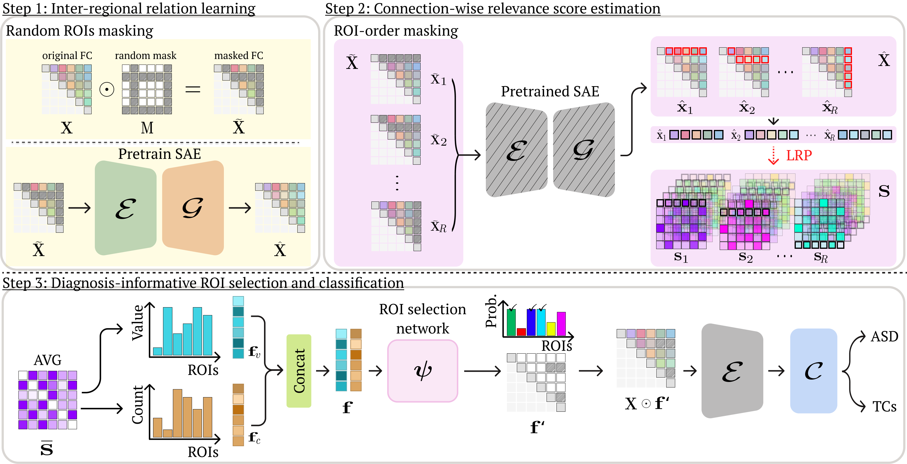

## EAG-RS: A Novel Explainability-guided ROI Selection Framework for ASD diagnosis via Inter-regional Relation Learning
<p align="center"></p>

This repository provides the official PyTorch implementation of the following paper:
> **EAG-RS: A Novel Explainability-guided ROI Selection Framework for ASD diagnosis via Inter-regional Relation Learning**<br>
> [Wonsik Jung](https://github.com/ssikjeong1/)<sup>1</sup>, [Eunjin Jeon]()<sup>1</sup>, [Eunsong Kang]()<sup>1</sup>, [Heung-Il Suk](https://scholar.google.co.kr/citations?user=dl_oZLwAAAAJ&hl=ko)<sup>1</sup> 
> (<sup>1</sup>Korea University) <br/>
<!-- > [[Official version]](https://link.springer.com/chapter/10.1007/978-3-030-87196-3_27) [[ResearchGate]](https://www.researchgate.net/publication/353212364_Inter-Regional_High-level_Relation_Learning_from_Functional_Connectivity_via_Self-Supervision) <br> -->
> Under review (Accepted to MICCAI 2021)
> 
> **Abstract:** *Deep learning models based on resting-state functional magnetic resonance imaging (rs-fMRI) have been widely used to diagnose brain disease, particularly autism spectrum disorder (ASD). Existing studies used the functional connectivity (FC) of rs-fMRI and demonstrated notable classification performance. However, they have major limitations that include the lack of information in linear low-order FC as inputs to the model, not considering individual characteristics (i.e., different symptoms or varying stages of severity) among patients with ASD, and the difficulty in explaining the decision process. To address these issues, we propose a novel explainability-guided region of interest (ROI) selection (EAG-RS) framework that identifies non-linear high-order functional associations among brain regions by leveraging an explainable artificial intelligence technique and selects class-discriminative regions for brain disease identification.
Our proposed framework includes three steps; (i) inter-regional relation learning to estimate non-linear relations through random seed-based network masking, (ii) explainable connection-wise relevance score estimation to explore high-order relations between functional connections, and (iii) non-linear high-order FC-based diagnosis-informative ROI selection and classifier learning for ASD identification. We validate the effectiveness of our proposed method, by conducting experiments using the Autism Brain Imaging Database Exchange (ABIDE) dataset. Our proposed method achieves superior performance than those of comparative methods in various evaluation metrics. 
Further, we qualitatively analyzed the selected ROIs and identified ASD subtypes linked to previous neuroscientific studies.*

## Dependencies
* [Python 3.6+](https://www.continuum.io/downloads)
* [PyTorch 0.4.0+](http://pytorch.org/)
* [TensorFlow 1.3+](https://www.tensorflow.org/) (optional for tensorboard)

## Downloading datasets
To download the ABIDE dataset
* http://fcon_1000.projects.nitrc.org/indi/abide/
* http://preprocessed-connectomes-project.org/abide/Pipelines.html

## Usage
For training:


```
python main.py --gpu 0 --dataset 'ABIDE' --atlas 'HO' --remove_roi=0.1
```

## Citation
If you find this work useful for your research, please cite our [paper](https://link.springer.com/chapter/10.1007/978-3-030-87196-3_27):
```
@inproceedings{jung2021inter,
  title={Inter-regional High-Level Relation Learning from Functional Connectivity via Self-supervision},
  author={Jung, Wonsik and Heo, Da-Woon and Jeon, Eunjin and Lee, Jaein and Suk, Heung-Il},
  booktitle={International Conference on Medical Image Computing and Computer-Assisted Intervention},
  pages={284--293},
  year={2021},
  organization={Springer}
}
```

## Acknowledgements
This research was supported by the National Research Foundation of Korea (NRF) grant funded by the Korea government (No. 2022R1A4A1033856) and the Institute of Information & communications Technology Planning & Evaluation (IITP) grant funded by the Korea government (MSIT) No. 2022-0-00959 ((Part 2) Few-Shot Learning of Causal Inference in Vision and Language for Decision Making) and (No. 2019-0-00079, Artificial Intelligence Graduate School Program(Korea University)).

<!-- This work was supported by National Research Foundation of Korea (NRF) grant funded by the Korea government (MSIT) (No. 2019R1A2C1006543) and by Institute of Information & communications Technology Planning & Evaluation (IITP) grant funded by the Korea government(MSIT) (No. 2019-0-00079 ,  Artificial Intelligence Graduate School Program(Korea University)). -->
